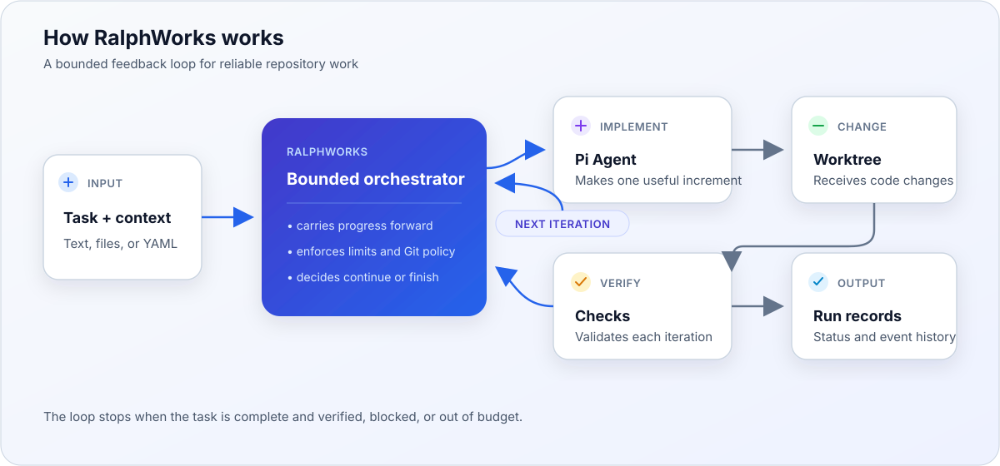

# RalphWorks

[](https://github.com/OctopusGarage/ralphworks/actions/workflows/ci.yml)
[](https://github.com/OctopusGarage/ralphworks/actions/workflows/gitleaks.yml)
[](https://github.com/OctopusGarage/ralphworks/releases/latest)
[](https://github.com/OctopusGarage/ralphworks/actions/workflows/smoke.yml)

[](LICENSE)

A bounded [Ralph loop](https://www.aihero.dev/getting-started-with-ralph) for coding tasks. Give it a goal; it runs [Pi](https://pi.dev) in fresh iterations, carries progress forward, checks the result, and stops when the task is done or a limit is reached.

## Get started

Requires Node.js 24. Install [Pi](https://pi.dev) and the [v0.1.0 release](https://github.com/OctopusGarage/ralphworks/releases/tag/v0.1.0), then configure a model in Pi with `/login` and `/model`. RalphWorks uses Pi's existing model and credentials; select another configured model with `--model provider/model-id`.

```bash
npm install -g @earendil-works/pi-coding-agent \
  https://github.com/OctopusGarage/ralphworks/releases/download/v0.1.0/ralphworks-0.1.0.tgz
pi # configure /login and /model, then exit

cd /path/to/your/repo
ralphworks run 'Fix the login error and add a regression test' --check 'npm test'
```

Run the command from the repository you want to change. Edits stay in that worktree. `--check` runs after every iteration; a failing check sends its output into the next iteration. Omit it for exploratory work, but use checks that cover the acceptance criteria for unattended tasks.
Without checks, `completed` means the agent reported completion; it does not independently verify the result.

## The loop



1. Pi reads the task and saved progress, then works on one useful increment.
2. RalphWorks runs the configured checks and records the outcome.
3. A new Pi session receives that progress and continues. The loop stops on completion, a blocker, or an iteration, time, or cost limit.

The default limit is **five iterations**. Progress and results live in `.ralph/`; inspect the latest run with `ralphworks status .ralph/current`. Completion requires the agent's completion signal and, when configured, passing checks. RalphWorks can commit passing iterations with `--commit verified`; otherwise it leaves changes for you to review.

## Give it a task

Use direct text, any plain text or Markdown file, or a small YAML job. Plain task files have no required name or format. Add supporting files or directories with repeatable `--context`.
For longer work, write small checklist items with observable acceptance criteria; RalphWorks carries progress across fresh sessions without requiring a special PRD format. See the [multi-item task example](docs/USAGE.md#multi-item-tasks).

```bash
ralphworks run ./docs/feature.md --context ./docs/api --max-iterations 8
ralphworks run 'Add CSV export' --check 'npm test' --commit verified
```

`--commit verified` requires a clean Git worktree and at least one check. The agent does not create commits itself. For reusable checks and limits, see the [YAML job format](docs/USAGE.md#structured-yaml-jobs).

For unattended work, start on a dedicated branch and give the loop an independent acceptance check:

```bash
ralphworks run ./docs/feature.md --check 'npm test' --commit verified --max-minutes 30 --max-cost-usd 3
```

## Choose where it runs

| Mode | Command | Result |
| --- | --- | --- |
| Host | `ralphworks run task.md` | Edits the current worktree. |
| Docker mount | `ralphworks run task.md --executor docker` | Edits the mounted worktree. |
| Docker clone | `ralphworks run task.md --executor docker-clone --repo owner/repo --ref branch` | Exports a patch from a clean clone. |
| GitHub Actions | `ralphworks remote task.md --repo owner/repo --ref branch` | Downloads a patch and run records. |

Docker requires the [sandbox image](docs/USAGE.md#docker-execution). Clone and GitHub Actions modes require the task and inputs on the selected branch; they never push generated code. For GitHub Actions, run `ralphworks init` in the target repository, commit the generated workflow, then configure `RALPHWORKS_MODEL` and a provider secret as described in the [remote setup guide](docs/USAGE.md#github-actions-execution). Continue an unfinished remote run with `--resume-from <run-id>` on the same unchanged branch.
Docker and remote commands have a 120-minute total deadline, including setup; change it with `--total-minutes N`. For interrupted local runs, follow the [recovery steps](docs/USAGE.md#recovering-an-interrupted-local-run) before restarting verified commits.

[Full usage and configuration](docs/USAGE.md) · [Architecture](docs/ARCHITECTURE.md) · [Contributing](CONTRIBUTING.md) · [Security](SECURITY.md) · [License](LICENSE)
