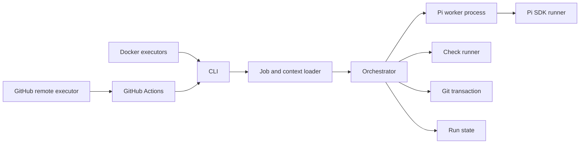
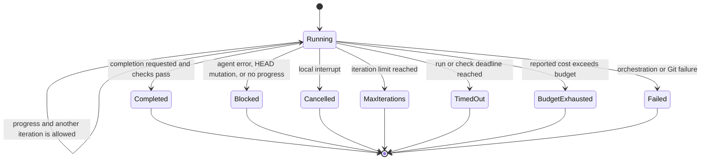
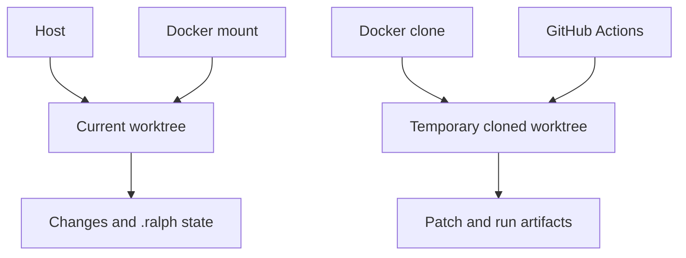

# RalphWorks Architecture

RalphWorks separates job parsing, loop orchestration, agent execution, environment selection, Git policy, and result delivery. See the [usage guide](USAGE.md) for the public execution contract.

## Modules

| Module | Responsibility |
| --- | --- |
| `cli.ts` | Selects commands and execution environments, reports exit status and output locations. |
| `job.ts` | Loads direct task text, plain text files, or restricted YAML and validates job fields. |
| `run-args.ts` | Parses CLI overrides, model selection, Pi configuration, and environment forwarding. |
| `orchestrator.ts` | Owns the state machine, limits, checks, progress, commits, and terminal result. |
| `pi-process-runner.ts`, `pi-worker.ts` | Isolate each CLI Pi iteration in a process that can be stopped at the run deadline. |
| `pi-runner.ts` | Creates one Pi SDK session per iteration and normalizes model events, output, errors, and cost. |
| `runner.ts` | Defines the small runner interface and the diagnostic dry-run implementation. |
| `run-lock.ts` | Prevents concurrent mutation of one worktree and maintains lock heartbeat state. |
| `git-transaction.ts` | Verifies the baseline, fingerprints worktree progress, detects HEAD changes, and commits verified work. |
| `docker-mount-executor.ts` | Mounts the current worktree into the sandbox and writes changes back to the host. |
| `docker-clone-executor.ts` | Clones a branch into the sandbox and exports an inspectable binary patch plus run records. |
| `docker-env.ts` | Transfers only selected model, Pi, check, context, override, and provider environment settings. |
| `remote-executor.ts` | Dispatches GitHub Actions, correlates the run, waits for completion, and downloads artifacts. |
| `init.ts` | Adds the target repository workflow and ignores local RalphWorks state without overwriting existing files. |
| `status.ts`, `trace.ts` | Read compact summaries from structured result and event files. |

## Core state machine

The orchestrator is the authority for completion. A runner may request completion, but the orchestrator also requires every configured check to pass. It owns these transitions:

Every iteration receives the same job plus a bounded view of the persisted progress file. The full history remains on disk. The Pi session itself is new, so durable state remains inspectable and does not depend on hidden conversation history. Runner events are appended between `iteration_started` and `iteration_finished`. The final aggregate is written to `result.json` and `.ralph/current` is updated only after result persistence.

## Completion and validation

RalphWorks injects a completion instruction into the Pi prompt. The configured completion value defaults to `DONE`; the runner recognizes it only in the assistant output protocol. The task text containing the same word does not complete the run.

Checks run after the agent step. When no checks are configured, the check set is considered satisfied. With checks, all commands must exit successfully during the same iteration. A failed check allows another iteration while limits permit; a bounded excerpt of its output is carried into the next Pi session.

Every run defaults to a 30-minute wall-clock limit unless the job or CLI supplies a value. Unattended Docker and GitHub Actions runs also default to $3. CLI Pi iterations run in a child process; at the deadline or on a local interrupt, RalphWorks terminates its process group before releasing the lock. Active checks are stopped in the same way. Custom in-process runners must honor abort signals. Cost is known after Pi reports the iteration, so a single iteration can cross the configured ceiling.

The Docker and remote adapters have a separate 120-minute default outer deadline for setup, agent execution, and result delivery. `--total-minutes` overrides it. A timed-out Docker adapter attempts to force-remove its named container. A timed-out remote wait requests cancellation of its Actions run and returns the run URL for follow-up.

## Git ownership

RalphWorks owns commits when `commit: verified` is enabled:

1. Require a clean baseline and at least one check.
2. Capture Git HEAD before the agent step.
3. Block if the agent changes HEAD.
4. Run all configured checks.
5. Commit the verified worktree when checks pass.

This keeps commit creation behind the validation boundary. It does not provide a rollback transaction: modifications remain available for inspection when a run fails, and an unexpected agent commit must be reviewed manually.

## Execution and delivery boundaries

- `host` runs orchestration in the caller process and Pi iterations in child processes against the current worktree.
- `docker` mounts that worktree at `/workspace`; it includes uncommitted input and writes changes back.
- `docker-clone` starts from a pushed GitHub ref and exports artifacts before the container is removed.
- `remote` dispatches a generated GitHub Actions workflow, then downloads the uploaded artifacts.

Docker uses Pi's native configuration files. Provider credentials are forwarded by environment variable name rather than embedded in command arguments. GitHub Actions reconstructs non-secret model configuration from the repository and credentials from Actions secrets.

Remote and clone modes deliberately return a patch. They do not mutate the caller's branch, push, open a pull request, or merge. This leaves review and repository delivery policy outside the execution engine.

## Persistent files

| Path | Purpose |
| --- | --- |
| `.ralph/current` | Relative pointer to the most recent run. |
| `.ralph/progress/<job>-<task-hash>.md` | Durable progress shared by iterations and later runs of the same task. |
| `.ralph/runs/<job>-<timestamp>/events.jsonl` | Ordered orchestration and normalized Pi events. |
| `.ralph/runs/<job>-<timestamp>/result.json` | Terminal state, iteration count, checks, cost, commits, and optional reason. |
| `.ralph/run.lock/` | Worktree mutual exclusion and heartbeat data. |
| `.ralph/exports/<id>/` | Docker clone patch and result export. |
| `.ralph/remote/<run-id>/` | Downloaded GitHub Actions artifacts. |

## Intentional limits

- The YAML parser supports a small reviewed subset rather than general YAML.
- Local runs start a new process and reuse saved progress for the same task. Remote runs can restore a prior run's patch and progress on the same unchanged branch with `--resume-from`.
- YAML `mode: remote` is rejected during parsing; GitHub delivery uses the separate `remote` command.
- There is no automatic branch, push, pull request, merge, deployment, dashboard, or general command policy engine.
- Docker is an execution boundary, not a trust boundary for arbitrary job and check commands.
